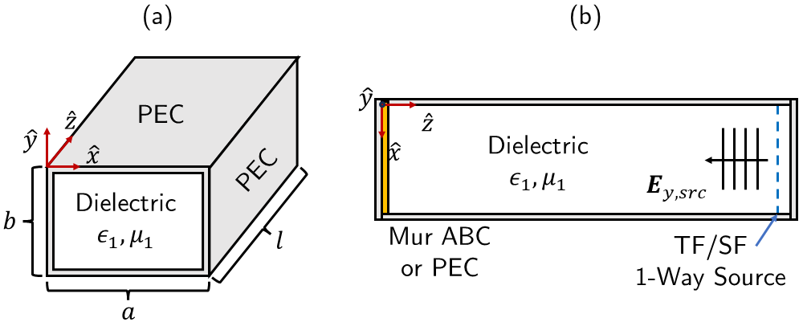
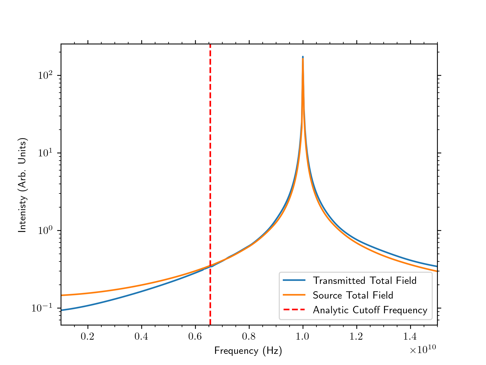
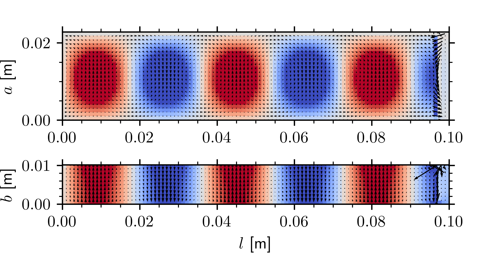
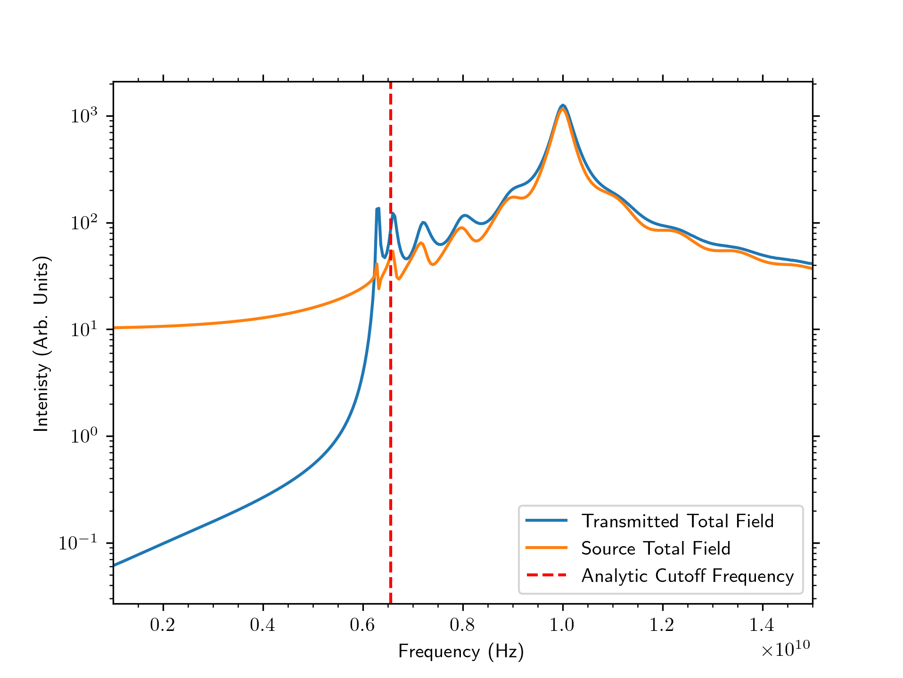
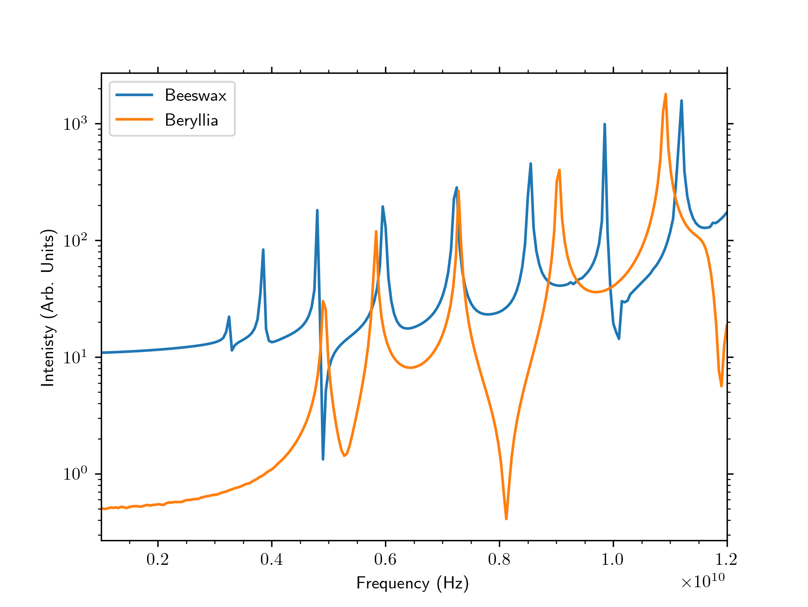

# fdtd-waveguide
A 3D Finite-Difference Time-Domain solver for a graduate CEM course offered at Purdue University.
At the request of the instructor, the course details and project report have been removed from this repository.
Please reach out if you are interested in the course details and project report.

This codebase, as well as others from this class, are not designed to be user-friendly as they were only intended to be run by myself for the purpose of a class project.
With that said however all code is reasonably documented to the standards outlined in this course.

## Release Builds
To compile a release build, please follow these steps.

If you do not have it installed already, you will first need to [download and install Rust](https://www.rust-lang.org/).

Next, set the following environment variable in your preferred terminal to generate optimized SIMD instructions for your CPU. 

    RUSTFLAGS = "-C target-cpu=native"

The codebase can now be compiled with the following command
    

    cargo build --release

## Running
Prior to running ensure all model parameters in `config.toml` are set appropriately. 
The model will pass these parameters to the engine. 

**WARNING** It is recommended to set `snapshot_steps` to a small number unless you are certain you need a large number of timesteps. 
It is very easy to inadvertently generate Gigabytes of data per run if you are not careful.

Once compiled, the release build can be found under `./target/release/driver.<>` where `.<>` corresponds to the file extension of executables on your platform.

## Data
Field data is stored in the `./out/` directory in `.csv` format. 
For example, the x component of the E field is stored in `./out/ex.csv`.
Rows of these csv files correspond to field values at a given time step in Fortran-style column-ordering.

## Documentation
To generate full project documentation in the form of a Doxygen-style webpage, run the following command in your terminal from the project root.

    cargo doc --document-private-items

After running this command, all generated documentation can be viewed by opening either `./target/doc/waveguide/index.html` or `./target/doc/driver/index.html`.

## Example Results
Below are several labeled figures from the report.
1. High-level waveguide diagram

2. Comparison of source and transmitted tapered sine fields to that of the analytic cutoff frequency.

3. Field profiles of (top color) y component of electric field (top arrows) x and y components of magnetic field, (bottom color) x component of magnetic field, and (bottom arrows) y and z components of electric field.

   
4. Comparison of source and transmitted wideband Gaussian pulse fields to that of the analytic cutoff frequency.

5. Comparison of Beeswax to Beryllia filled cavity resonator with Mur ABC replaced by PEC wall

